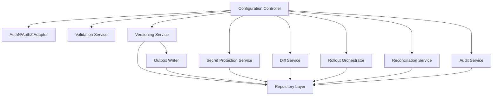

# C4 Model — Component (L3) для Config API Service

## Назначение
Внутренняя декомпозиция `Config API Service` для реализации управления конфигурациями, версионирования, безопасности, аудита и управления rollout.

## Компоненты
- AuthN/AuthZ Adapter
  - Валидация JWT, получение claims/roles, применение RBAC/ACL.
- Configuration Controller
  - REST endpoints для CRUD, фильтрации и чтения текущего состояния.
- Versioning Service
  - Создание новой версии на каждое изменение, rollback как новая версия, получение истории и конкретных версий.
- Diff Service
  - Вычисление diff между версиями и подготовка diff для audit.
- Validation Service
  - Валидация payload форматов (`key-value`, `JSON`, `YAML`).
- Secret Protection Service
  - Шифрование/дешифрование секретов, маскирование при недостатке прав.
- Rollout Orchestrator
  - Запуск/остановка/откат rollout (instant/gradual/canary) и хранение состояния rollout.
- Reconciliation Service
  - Сверка версий клиента с серверной актуальной версией, сценарий snapshot + catch-up.
- Audit Service
  - Формирование и запись audit-событий по операциям.
- Repository Layer
  - Доступ к PostgreSQL (configs, versions, outbox, audit, rollout).
- Outbox Writer
  - Запись события доставки в outbox в рамках той же транзакции, что и новая версия.

## Диаграмма

## Поток критической операции (update config)
1. `Configuration Controller` принимает запрос обновления.
2. `AuthN/AuthZ Adapter` проверяет доступ к `service/environment` и типу данных (включая секреты).
3. `Validation Service` валидирует формат.
4. `Versioning Service` в транзакции создает новую версию.
5. `Diff Service` формирует diff (для API и audit).
6. `Outbox Writer` в той же транзакции пишет событие доставки.
7. `Audit Service` фиксирует изменение и метаданные источника.
8. Async `Delivery Publisher Worker` публикует outbox-событие в Centrifugo после commit.

## Явные допущения
- Шифрование секретов выполняется на уровне приложения с внешним key-provider (например, KMS/Vault), конкретная реализация уточняется позже.
- Формат diff фиксируется как структурированный JSON diff (может быть уточнен в следующих этапах).
