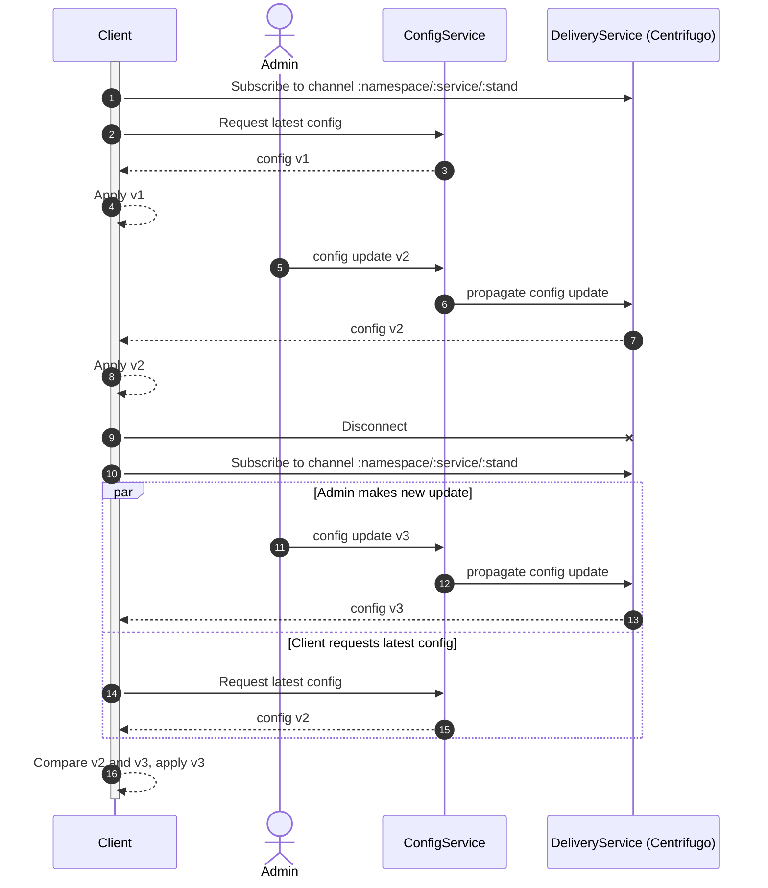

Диаграмма для кейса:
- Без Centrifugo history
- С отправкой конфигов целиком, без диффов

В целом должно работать с небольшими изменениями для history + отправки диффов

Блок диаграммы после дисконнекта показывает, как Client SDK будет обрабатывать catch-up к актуальной версии конфига
Основная идея - сначала начинаем слушать канал, только потом запрашиваем latest конфиг

