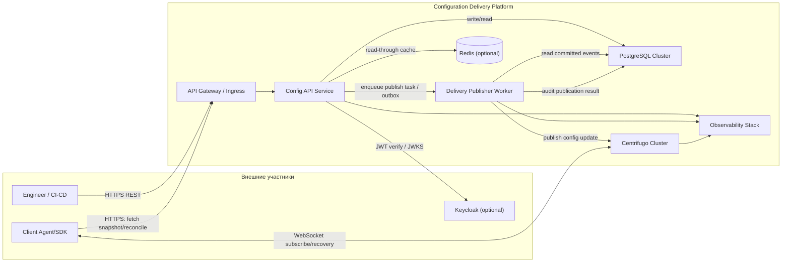

# C4 Model — Container (L2)

## Назначение
Уровень контейнеров показывает основные runtime-компоненты платформы и их взаимодействия.

## Контейнеры
- API Gateway / Ingress
  - TLS termination, маршрутизация, базовые политики доступа.
- Config API Service
  - CRUD конфигураций и секретов, версионирование, rollback, diff, аудит, rollout orchestration.
- Delivery Publisher Worker (async)
  - Асинхронная публикация событий доставки после commit в БД, retry с exponential backoff, идемпотентность публикаций.
- PostgreSQL Cluster (primary + replicas, >=3 nodes)
  - Source of truth: конфигурации, версии, rollout-состояния, аудит.
- Redis (опциональный cache/read-path accelerator)
  - Ускорение read-path для достижения высоких RPS.
- Centrifugo Cluster
  - WebSocket pub/sub доставка обновлений агентам, history/recovery в окне хранения.
- Observability Stack (Prometheus + logs + tracing backend)
  - Метрики, структурированные логи, correlation_id, distributed tracing.
- Keycloak (опционально)
  - Выдача JWT и role/claim контекста для RBAC/ACL.
- Client Agent/SDK
  - Постоянное WS-соединение к Centrifugo, локальная последняя версия, auto-reconnect, применение конфигурации.

## Диаграмма

## Важные архитектурные решения
- Публикация в Centrifugo отделена в async-компоненте для выполнения требования «publish только после commit в PostgreSQL».
- PostgreSQL остается source of truth; доставка является eventual consistent.
- Для высоких read-нагрузок предусмотрен cache/read replicas.
- Recovery ограничен окном history/recovery Centrifugo.

## Явные допущения
- Для согласованности publish-потока используется паттерн transactional outbox.
- Redis введен как опциональный контейнер для достижения NFR по read throughput.
