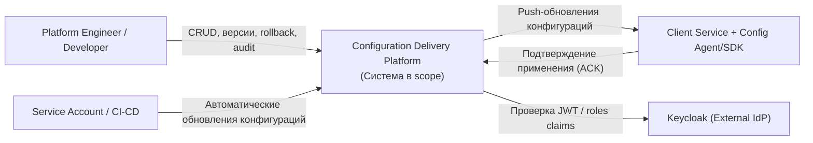

# C4 Model — System Context (L1)

## Назначение
Distributed Real-Time Configuration Delivery Platform управляет конфигурациями и секретами, версионирует изменения и доставляет обновления клиентским агентам в реальном времени.

## Границы системы
Система включает backend-компоненты управления конфигурациями и доставки событий, но не включает UI как отдельный проектируемый компонент в рамках текущего scope.

## Внешние акторы и системы
- Platform Engineer / Developer — управляет конфигурациями, версиями, rollout и rollback.
- Service Account / CI-CD — автоматизированно вносит изменения конфигураций.
- Client Service with Agent/SDK — получает и применяет конфигурации.
- Keycloak (опционально, при внедрении) — внешний IdP для JWT-аутентификации и RBAC-контекста.

## Диаграмма

## Ключевые сценарии
1. Пользователь или CI/CD изменяет конфигурацию через API.
2. Система сохраняет новую версию в PostgreSQL.
3. После commit система публикует событие доставки через Centrifugo.
4. Агент получает обновление и применяет его без перезапуска сервиса.
5. При reconnection агент проходит reconciliation версии с сервером и догоняет актуальное состояние.

## Явные допущения
- UI не проектируется отдельно на текущем этапе.
- Auth-модель: JWT + RBAC/ACL; Keycloak рассматривается как целевой внешний провайдер (опционально по срокам).
- Endpoints для ACK/Error от клиента не включаются в OpenAPI как публичные (по подтвержденному scope).
